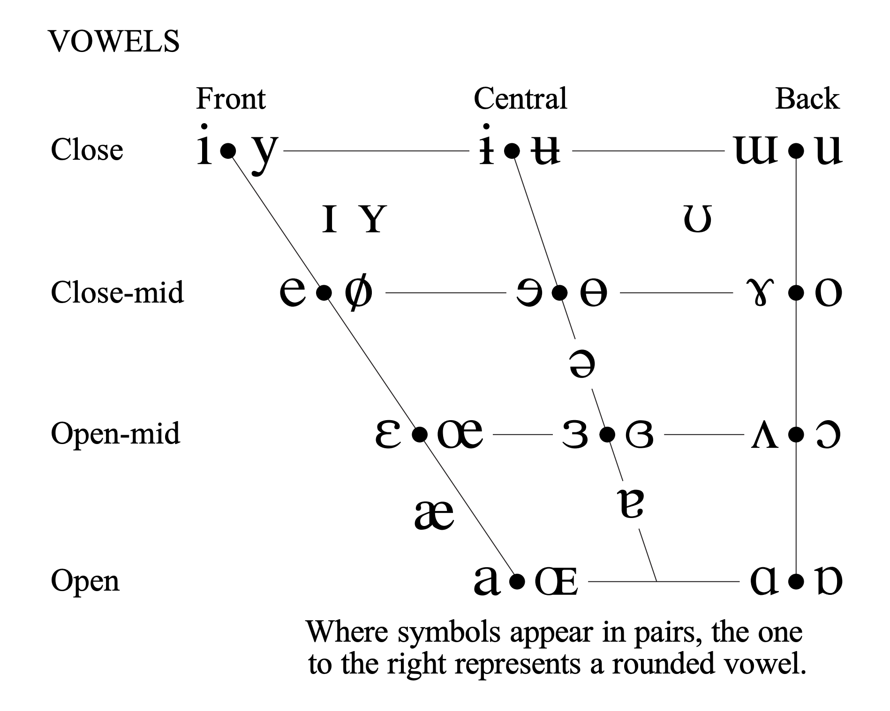

## 一、德语字母表（Das Alphabet）

德语有 **26 个基本字母 + 4 个特殊字母**（ä, ö, ü, ß）

| 字母 | 德语读法 | 字母 | 德语读法     |
| ---- | -------- | ---- | ------------ |
| A a  | `[aː]`   | N n  | `[ɛn]`       |
| B b  | `[beː]`  | O o  | `[oː]`       |
| C c  | `[tseː]` | P p  | `[peː]`      |
| D d  | `[deː]`  | Q q  | `[kuː]`      |
| E e  | `[eː]`   | R r  | `[ɛʁ]`       |
| F f  | `[ɛf]`   | S s  | `[ɛs]`       |
| G g  | `[geː]`  | T t  | `[teː]`      |
| H h  | `[haː]`  | U u  | `[uː]`       |
| I i  | `[iː]`   | V v  | `[faʊ]`      |
| J j  | `[jɔt]`  | W w  | `[veː]`      |
| K k  | `[kaː]`  | X x  | `[ɪks]`      |
| L l  | `[ɛl]`   | Y y  | `[ˈʏpsilɔn]` |
| M m  | `[ɛm]`   | Z z  | `[tsɛt]`     |

**特殊字母：**
| 字母 | 名称 | 读法 |
|------|------|------|
| Ä ä | A-Umlaut | `[ɛː]` |
| Ö ö | O-Umlaut | `[øː]` |
| Ü ü | U-Umlaut | `[yː]` |
| ß | Eszett / scharfes S | `[ɛsˈtsɛt]` |

---

## 二、元音系统（Vokale）⭐ 最重要的部分

### 核心规则：德语元音分 **长音** 和 **短音**

这是德语发音的**灵魂**，长短不同，意思可能完全不同！

| 情况                        | 元音读 | 例子                           |
| --------------------------- | ------ | ------------------------------ |
| 元音后跟 **单个辅音**       | 长音   | **V**a·ter, **w**e·gen         |
| 元音后跟 **h**（h 不发音）  | 长音   | f**ah**ren, s**eh**en, **Uh**r |
| **双写**元音                | 长音   | S**aa**t, M**ee**r, B**oo**t   |
| 元音后跟 **双辅音或辅音群** | 短音   | Ma**nn**, Be**tt**, ki**nd**   |
| 开音节（以元音结尾）        | 长音   | O·pa, Ta·ge                    |

---

### 2.1 基本元音：A, E, I, O, U

IPA Chart 如图所示：



#### **A**

|           | 发音         | 参照              | 例词                            |
| --------- | ------------ | ----------------- | ------------------------------- |
| 长 `[aː]` | 嘴张大，拉长 | 英语 "father"     | V**a**ter, Str**a**ße, B**ah**n |
| 短 `[a]`  | 嘴张大，短促 | 英语 "cut" 的元音 | M**a**nn, k**a**lt, **a**lt     |

#### **E**

|            | 发音         | 参照                        | 例词                             |
| ---------- | ------------ | --------------------------- | -------------------------------- |
| 长 `[eː]`  | 嘴微扁，拉长 | 🇫🇷 **é**（如 été）          | W**e**g, l**e**ben, M**ee**r     |
| 短 `[ɛ]`   | 嘴略开，短促 | 英语 "bed"                  | B**e**tt, R**e**st, h**e**lfen   |
| 弱读 `[ə]` | 轻"呃"       | 🇫🇷 "le" 中的 e / 英语 "the" | Lied**e**r, Lieb**e**, Katz**e** |

> ⚠️ 德语词尾的 **-e** 不像法语那样是哑音——德语的 -e 要轻轻读出一个 `[ə]`！
>
> - Katze → `[ˈkatsə]`（不是 katz）
> - Liebe → `[ˈliːbə]`（不是 lieb）

#### **I**

|           | 发音         | 参照                    | 例词                            |
| --------- | ------------ | ----------------------- | ------------------------------- |
| 长 `[iː]` | 嘴扁，拉长   | 英语 "machine"、🇫🇷 "si" | **i**hm, K**i**no, Masch**i**ne |
| 短 `[ɪ]`  | 嘴略松，短促 | 英语 "bit"              | M**i**tte, K**i**nd, b**i**tte  |

> **ie** 组合 = 长 `[iː]`：d**ie**, L**ie**be, sp**ie**len

#### **O**

|           | 发音           | 参照               | 例词                            |
| --------- | -------------- | ------------------ | ------------------------------- |
| 长 `[oː]` | 嘴圆，拉长     | 🇫🇷 "beau"          | B**oo**t, **o**hne, r**o**t     |
| 短 `[ɔ]`  | 嘴圆略开，短促 | 英语 "got"（英式） | G**o**tt, S**o**nne, k**o**mmen |

#### **U**

|           | 发音           | 参照                 | 例词                           |
| --------- | -------------- | -------------------- | ------------------------------ |
| 长 `[uː]` | 嘴圆收紧，拉长 | 英语 "food"、🇫🇷 "où" | Sch**u**h, M**u**t, g**u**t    |
| 短 `[ʊ]`  | 嘴略松，短促   | 英语 "put"           | M**u**tter, H**u**nd, r**u**nd |

---

### 2.2 变元音 / 曲音（Umlaute）⭐⭐

> 🇫🇷 **你的法语背景在这里大显身手！**

#### **Ä**

|           | 发音            | 参照                                 | 例词                             |
| --------- | --------------- | ------------------------------------ | -------------------------------- |
| 长 `[ɛː]` | 嘴略开，拉长    | 🇫🇷 "è"（如 mère）/ 英语 "air" 去掉 r | K**ä**se, sp**ä**t, **Ä**rzt     |
| 短 `[ɛ]`  | 和短 e 几乎一样 | 英语 "bed"                           | M**ä**nner, K**ä**lte, H**ä**nde |

#### **Ö** 🇫🇷

|           | 发音             | 参照                         | 例词                              |
| --------- | ---------------- | ---------------------------- | --------------------------------- |
| 长 `[øː]` | 嘴圆 + 发 `[eː]` | 🇫🇷 **"eu"**（如 peu, bleu）  | sch**ö**n, b**ö**se, K**ö**ln     |
| 短 `[œ]`  | 嘴圆 + 发 `[ɛ]`  | 🇫🇷 **"œu"**（如 peur, sœur） | L**ö**ffel, k**ö**nnen, zw**ö**lf |

> 💡 方法：先发 `[e]` 的口型，然后把嘴唇撅圆，声音不变 → 就是 ö

#### **Ü** 🇫🇷

|           | 发音             | 参照                           | 例词                           |
| --------- | ---------------- | ------------------------------ | ------------------------------ |
| 长 `[yː]` | 嘴圆 + 发 `[iː]` | 🇫🇷 **"u"**（如 tu, rue, lune） | **ü**ber, T**ü**r, gr**ü**n    |
| 短 `[ʏ]`  | 嘴圆 + 发 `[ɪ]`  | 🇫🇷 短促的 u                    | Gl**ü**ck, St**ü**ck, f**ü**nf |

> 💡 方法：先发 `[i]` 的口型，然后把嘴唇撅圆，声音不变 → 就是 ü

---

### 2.3 双元音（Diphthonge）

德语只有 **3 个双元音**，非常规律：

| 拼写            | 发音   | 参照            | 例词                                |
| --------------- | ------ | --------------- | ----------------------------------- |
| **ei** / **ai** | `[aɪ]` | 英语 "my, eye"  | **Ei**s, W**ei**n, M**ai**, H**ai** |
| **au**          | `[aʊ]` | 英语 "how, cow" | H**au**s, Fr**au**, B**au**m        |
| **eu** / **äu** | `[ɔʏ]` | 英语 "boy, toy" | n**eu**, Fr**eu**nd, H**äu**ser     |

### 2.4 鼻音

德语没有鼻化元音！法语的 an/en `[ɑ̃]`、on `[ɔ̃]`、in `[ɛ̃]`、un `[œ̃]` 是把元音「鼻化」，鼻音彻底融入元音中，是一个纯粹的元音。

德语完全不同——元音和鼻辅音分开发，每个字母都老老实实读出来。

#### **-an / -ann**

| 拼写                 | 发音    | 例词                                                 |
| -------------------- | ------- | ---------------------------------------------------- |
| **an**（长 a + n）   | `[aːn]` | B**ah**n `[baːn]`, Pl**an** `[plaːn]`                |
| **ann**（短 a + nn） | `[an]`  | M**ann** `[man]`, k**ann** `[kan]`, d**ann** `[dan]` |

> ⚠️ 法语者常见错误：把 Mann 读成 `[mɑ̃]`。
>
> ✅ 正确：`[man]` —— a 是纯净的 `[a]`，n 是清晰的 `[n]`。在发音结束时，你的舌尖会抬起，抵住上齿龈，气流被阻断后完全从鼻腔流出。换句话说，它有一个明显的 `[n]` 辅音动作作为收尾。

#### **-en** ⭐⭐⭐（德语最高频的音节！）

**-en** 作为词尾（动词不定式、复数等）出现频率极高：

| 情况          | 发音                          | 例词                                         |
| ------------- | ----------------------------- | -------------------------------------------- |
| 标准发音      | `[ən]`（弱读 e + n）          | hab**en** `[ˈhaːbən]`, Leb**en** `[ˈleːbən]` |
| 日常口语中    | `[n̩]`（成音节 n，e 几乎消失） | hab**en** `[ˈhaːbm̩]`, lauf**en** `[ˈlaʊfn̩]`  |
| 在 b/p/m 之后 | 常同化为 `[m̩]`                | hab**en** `[ˈhaːbm̩]`, komm**en** `[ˈkɔmm̩]`   |

> 💡 **成音节鼻音 `[n̩]`** 是什么意思？
>
> - 就是 n 单独构成一个音节，前面的 e 变得极弱甚至听不到
> - 类似英语 "garden" `[ˈɡɑːdn̩]` 里词尾的感觉
> - 在自然语速中，**-en** 几乎就是一个轻轻的 "n"
>
> 示例：
>
> - sprechen → `[ˈʃpʁɛçn̩]`（不是"嘘普雷**尚**"）
> - fahren → `[ˈfaːʁən]`
> - leben → `[ˈleːbm̩]`（n 被前面的 b 同化为 m）

#### **-em / -el / -eln**

同样常见的弱读音节：

| 拼写     | 发音              | 例词                                |
| -------- | ----------------- | ----------------------------------- |
| **-em**  | `[əm]` 或 `[m̩]`   | ein**em** `[ˈaɪnəm]`, dies**em**    |
| **-el**  | `[əl]` 或 `[l̩]`   | Vög**el** `[ˈføːɡl̩]`, Mitt**el**    |
| **-eln** | `[əln]` 或 `[l̩n]` | samm**eln** `[ˈzaml̩n]`, hand**eln** |

> 练习：想象你正要发「勒」的音，但把最后的元音掐掉，只留舌尖抵住的那一下。这个感觉就是 `[l̩]`。

> eln 的逻辑在于 `[l]` + `[n]` 的快速无缝切换。具体动作：
>
> 1. 舌尖抵住上齿龈发 `[l]`（气流从舌头两侧出）。
> 2. 舌尖不离开上齿龈，直接转为发 `[n]`（关闭口腔通道，让气流从鼻子出）。

---

#### **-ng `[ŋ]`** ⭐

| 规则                            | 例词        | 发音                              |
| ------------------------------- | ----------- | --------------------------------- |
| ng = **纯 `[ŋ]`**，不读 `[g]`！ | Ri**ng**    | `[ʁɪŋ]` ✅ 不是 `[ʁɪŋɡ]` ❌       |
|                                 | si**ng**en  | `[ˈzɪŋən]` ✅ 不是 `[ˈzɪŋɡən]` ❌ |
|                                 | la**ng**    | `[laŋ]`                           |
|                                 | Zeitu**ng** | `[ˈtsaɪtʊŋ]`                      |

> ⚠️ 和英语一样——“sing” 里的 ng 不带 g 音。
> 但注意：英语 finger = `[ˈfɪŋɡər]`（有 `[g]`），德语 Finger = `[ˈfɪŋɐ]`（有些方言有 `[g]`，标准发音可带可不带）。

#### **-nk `[ŋk]`**

| 规则                           | 例词        | 发音         |
| ------------------------------ | ----------- | ------------ |
| nk = `[ŋk]`，n 被后面的 k 同化 | da**nk**e   | `[ˈdaŋkə]`   |
|                                | tri**nk**en | `[ˈtʁɪŋkən]` |
|                                | de**nk**en  | `[ˈdɛŋkən]`  |
|                                | Ba**nk**    | `[baŋk]`     |

> 和英语 “think” `[θɪŋk]` 的原理完全一样。

#### 3.6 **-ung `[ʊŋ]`** ⭐

这是德语超高频的**名词后缀**（相当于英语 -tion/-ment/-ing）：

| 例词               | 发音             | 意思   |
| ------------------ | ---------------- | ------ |
| Zeit**ung**        | `[ˈtsaɪtʊŋ]`     | 报纸   |
| Wohn**ung**        | `[ˈvoːnʊŋ]`      | 公寓   |
| Üb**ung**          | `[ˈyːbʊŋ]`       | 练习   |
| Entschuld**ig**ung | `[ɛntˈʃʊldɪɡʊŋ]` | 对不起 |
| Ordn**ung**        | `[ˈɔʁdnʊŋ]`      | 秩序   |

> 💡 注意：是 `[ʊŋ]`（短 u + ng），**不是** 法语式的鼻化 `[ɔ̃]`！

#### 同化

在自然语速中，鼻音会受前后辅音影响发生**同化**（assimilation）：

| 鼻音 + 后接辅音 | 鼻音变为          | 例子                                                            |
| --------------- | ----------------- | --------------------------------------------------------------- |
| n + b/p →       | `[m]`             | a**nb**ieten → `[ˈambiːtən]`；u**nb**eka**n**nt → `[ˈʊmbəkant]` |
| n + g/k →       | `[ŋ]`             | a**nk**ommen → `[ˈaŋkɔmən]`                                     |
| n + f →         | `[ɱ]`（唇齿鼻音） | A**nf**ang → `[ˈaɱfaŋ]`（细微差别，不用刻意练）                 |

> 这些同化在快速语流中自然发生，不用死记，多听多模仿就好。

---

## 三、辅音系统（Konsonanten）

### 3.1 和英语基本相同的辅音

这些不用特别学：**f, k, m, n, p, t, x**

### 3.2 需要注意的辅音

#### **B, D, G → 词尾清化（Auslautverhärtung）** ⭐

这是德语最重要的辅音规则之一：

> **b, d, g 在音节末尾时，变成对应的清音 p, t, k**

| 字母  | 词首/元音前（浊音） | 词尾/音节末（清化） | 例子                                       |
| ----- | ------------------- | ------------------- | ------------------------------------------ |
| **b** | `[b]`（如英语）     | → `[p]`             | lie**b** `[liːp]`, Ur·lau**b** `[ˈʊɐlaʊp]` |
| **d** | `[d]`（如英语）     | → `[t]`             | Kin**d** `[kɪnt]`, Hun**d** `[hʊnt]`       |
| **g** | `[g]`（如英语）     | → `[k]`             | Ta**g** `[taːk]`, We**g** `[veːk]`         |

> 🇫🇷 法语没有这个现象，但你记住规则就好：**浊音到了词尾就「硬化」**。

#### **H**

| 位置        | 发音                           | 例词                           |
| ----------- | ------------------------------ | ------------------------------ |
| 词首/音节首 | 送气 `[h]`，和英语一样         | **H**aus, **H**erz, **h**aben  |
| 元音后      | **不发音**，仅表示前面元音拉长 | ge**h**en, U**h**r, fa**h**ren |

#### **J**

| 发音  | 参照            | 例词                       |
| ----- | --------------- | -------------------------- |
| `[j]` | 英语 "yes" 的 y | **j**a, **j**ung, **J**ahr |

> ⚠️ 不是法语的 j `[ʒ]`，也不是英语的 j `[dʒ]`！

#### **L**

| 发音                          | 参照                      | 例词                         |
| ----------------------------- | ------------------------- | ---------------------------- |
| `[l]` 舌尖轻抵上齿龈，light L | 🇫🇷 法语的 L（完全一样！） | **L**iebe, Ta**l**, vie**l** |

> ⚠️ 绝对不是英语词尾那种 dark L。用你法语的 L 就对了！

#### **R** ⭐⭐

| 位置                 | 发音                     | 参照                          | 例词                                        |
| -------------------- | ------------------------ | ----------------------------- | ------------------------------------------- |
| 词首/元音前          | 小舌颤音或擦音 `[ʁ]`     | 🇫🇷 **法语的 R（几乎一样！）** | **R**ot, **r**eisen, b**r**ingen            |
| 长元音后/词尾        | 弱化为 `[ɐ]`（像轻"啊"） | 类似英语 “uh”                 | Uhr `[uːɐ]`, Vater `[ˈfaːtɐ]`, wir `[viːɐ]` |
| 前缀 er-, ver-, zer- | 弱化为 `[ɐ]`             |                               | **er**zählen, **ver**stehen                 |

> 🎉 你会法语的 R，德语的 R 基本到手了！只需注意词尾 R 的弱化。
>
> 对比：
>
> - Reise → `[ˈʁaɪzə]`（词首：像法语 R，正常发）
> - Vater → `[ˈfaːtɐ]`（词尾：弱化成"法特**啊**"）
> - Uhr → `[uːɐ]`（长元音后：弱化成"乌**啊**"）

#### **S** ⭐⭐

S 的发音取决于位置：

| 位置            | 发音       | 参照        | 例词                                       |
| --------------- | ---------- | ----------- | ------------------------------------------ |
| **元音前**      | 浊音 `[z]` | 英语 "zoo"  | **S**onne, le**s**en, Ro**s**e             |
| **辅音前/词尾** | 清音 `[s]` | 英语 "see"  | La**s**t, Hau**s**, i**s**t                |
| **sp-**（词首） | `[ʃp]`     | 先"嘘"再"p" | **Sp**rache `[ˈʃpʁaːxə]`, **sp**ielen      |
| **st-**（词首） | `[ʃt]`     | 先"嘘"再"t" | **St**ein `[ʃtaɪn]`, **St**adt, **st**ehen |

> ⚠️ sp/st 只在 **词首或音节首** 才读 `[ʃp]`/`[ʃt]`！
>
> - **St**ein = `[**ʃt**aɪn]` ✅（词首）
> - fe**st** = `[fɛ**st**]` ✅（不在词首，正常读 st）

#### **ß（Eszett）和 SS**

| 写法   | 发音       | 出现位置              | 例词                              |
| ------ | ---------- | --------------------- | --------------------------------- |
| **ß**  | 清音 `[s]` | 长元音/双元音**之后** | Stra**ß**e, gro**ß**, wei**ß**    |
| **ss** | 清音 `[s]` | 短元音**之后**        | Wa**ss**er, mü**ss**en, e**ss**en |

> 💡 两者发音完全一样，都是清音 `[s]`。区别只在于前面元音的长短。

#### **V**

| 情况       | 发音  | 例词                                   |
| ---------- | ----- | -------------------------------------- |
| 德语本族词 | `[f]` | **V**ater, **v**iel, **v**ier, **v**on |
| 外来词     | `[v]` | **V**ase, **V**ioline, Uni**v**ersität |

> 💡 大多数常用词里 V = `[f]`。遇到拉丁/法语来源的词才读 `[v]`。

#### **W**

| 发音  | 参照              | 例词                             |
| ----- | ----------------- | -------------------------------- |
| `[v]` | 英语 "v" / 🇫🇷 "v" | **W**asser, **W**ein, **w**ohnen |

> ⚠️ 德语 W ≠ 英语 W！德语 W = 英语 V 的音！

#### **Z / TZ**

| 发音   | 参照              | 例词                                       |
| ------ | ----------------- | ------------------------------------------ |
| `[ts]` | 英语 "cats" 的 ts | **Z**eit, **Z**immer, Ka**tz**e, Pla**tz** |

> 这个音中文使用者其实很熟悉——接近拼音 `c` 的感觉。

### 3.3 组合辅音

#### **CH** ⭐⭐⭐（德语标志性发音）

CH 有两种完全不同的发音！

| 名称               | 出现位置                                                   | 发音                 | 参照                                      | 例词                                              |
| ------------------ | ---------------------------------------------------------- | -------------------- | ----------------------------------------- | ------------------------------------------------- |
| **Ach-Laut** `[x]` | 在 **a, o, u, au** 之后                                    | 舌根靠近软腭的摩擦音 | 用力读中文拼音 "h"                        | Bu**ch**, Na**ch**t, au**ch**, ko**ch**en         |
| **Ich-Laut** `[ç]` | 在 **e, i, ö, ü, äu, eu, 辅音** 之后；以及词首（某些情况） | 舌面靠近硬腭的摩擦音 | 英语 "huge" 的开头 h，但更明显；日语 "ひ" | i**ch**, Mil**ch**, dur**ch**, Che·mie, re**ch**t |

> 💡 **简单记法**：
>
> - 后元音（a, o, u, au）→ **喉咙后面**的 `[x]`（"啊赫"）
> - 前元音（e, i, ö, ü, eu, äu）+ 辅音 → **嘴巴前面**的 `[ç]`（"衣希"）
>
> 💡 **练习 Ich-Laut `[ç]`**：
>
> 1. 先发 `[iː]`
> 2. 保持舌头位置不动
> 3. 改为从舌面和上颚之间送气 → 就是 `[ç]`

**CH 的其他情况：**

| 拼写                  | 发音         | 例词                                  |
| --------------------- | ------------ | ------------------------------------- |
| **chs**               | `[ks]`       | se**chs**, wa**chs**en, O**chs**e     |
| **ch** 在词首 + a/o/u | `[k]`        | **Ch**or, **Ch**arakter, **Ch**ristus |
| **-chen**（小词后缀） | 永远是 `[ç]` | Mäd**chen**, Häus**chen**             |

#### **SCH**

| 发音  | 参照                          | 例词                               |
| ----- | ----------------------------- | ---------------------------------- |
| `[ʃ]` | 英语 "sh"、🇫🇷 "ch"（如 chat） | **Sch**ule, Fi**sch**, deut**sch** |

#### **PF** ⭐

| 发音   | 说明                | 例词                           |
| ------ | ------------------- | ------------------------------ |
| `[pf]` | p 和 f **快速连读** | **Pf**erd, A**pf**el, Ko**pf** |

> 💡 这是很多学习者觉得别扭的音。练习方法：先说 p，紧接着不松嘴直接接 f。

#### **QU**

| 发音   | 参照                | 例词                                 |
| ------ | ------------------- | ------------------------------------ |
| `[kv]` | 不是英语的 `[kw]`！ | **Qu**elle, **Qu**alität, be**qu**em |

> ⚠️ 英语 queen = `[kwiːn]` ，但德语 Quelle = `[kvɛlə]`。用 **v** 不是 **w**。

#### **NG / NK**

| 拼写   | 发音                                | 例词                           |
| ------ | ----------------------------------- | ------------------------------ |
| **ng** | `[ŋ]`（和英语 "sing" 一样，不发 g） | la**ng**, Ri**ng**, si**ng**en |
| **nk** | `[ŋk]`（和英语 "think" 一样）       | da**nk**e, tri**nk**en         |

#### **TION**（外来词后缀）

| 发音       | 例词                                     |
| ---------- | ---------------------------------------- |
| `[tsioːn]` | Na**tion**, Informa**tion**, Sta**tion** |

> ⚠️ 不像法语的 `[sjɔ̃]`，也不像英语的 `[ʃən]` ！德语读 `[tsioːn]`。

#### **TH**

| 发音                     | 例词                                |
| ------------------------ | ----------------------------------- |
| 就是 `[t]`！（h 不发音） | **Th**eater, **Th**ema, **Th**eorie |

> 🎉 没有英语那个让人头疼的 `[θ/ð]` 音！

---

## 四、重音规则（Betonung）

| 规则                                                        | 例子                                                |
| ----------------------------------------------------------- | --------------------------------------------------- |
| **大多数德语本族词：重音在第一个音节**                      | **LE**·ben, **AR**·bei·ten, **Haus**·auf·ga·be      |
| **不可分前缀 be-, ge-, er-, ver-, zer-, ent-, emp- 不重读** | be·**SUCH**·en, ge·**HÖ**·ren, ver·**STEH**·en      |
| **可分前缀重读**                                            | **AN**·fan·gen, **AUF**·ste·hen, **MIT**·brin·gen   |
| **外来词：重音常在后面的音节**                              | Stu·**DENT**, Uni·ver·si·**TÄT**, Infor·ma·**TION** |
| **-ieren 结尾：重读 -IE-**                                  | stu·**DIE**·ren, tele·fo·**NIE**·ren                |

---

## 五、德语特有现象：声门塞音（Knacklaut）

德语在**以元音开头的词或音节前**会加一个轻微的「声门塞音」（喉咙轻轻「卡」一下）：

| 例词          | 发音说明                      |
| ------------- | ----------------------------- |
| be\|achten    | be 和 a 之间有个微停          |
| ver\|arbeiten | 不会连读成"vera..."，中间断开 |
| \|Abend       | 词首元音前也有                |

> 🇫🇷 这和法语截然相反——法语爱连诵（liaison），德语则喜欢在元音前"断"一下。

---

## 六、总结对比表

### 和英语的关键区别

| 特征     | 英语            | 德语                    |
| -------- | --------------- | ----------------------- |
| W        | `[w]`（"乌"）   | `[v]`（"呜"）           |
| V        | `[v]`           | 多数读 `[f]`            |
| J        | `[dʒ]`          | `[j]`（= 英语 y）       |
| Z        | `[z]`           | `[ts]`                  |
| S + 元音 | 可清可浊        | 总是浊 `[z]`            |
| th       | `[θ]` 或 `[ð]`  | 就是 `[t]`              |
| R        | 卷舌/近音       | 小舌音 `[ʁ]`（≈法语 R） |
| ch       | `[tʃ]` 或 `[k]` | `[ç]` 或 `[x]`          |
| 词尾 -e  | 通常不读        | 要读 `[ə]`！            |

### 可以 relate 法语的地方

| 德语音      | 法语对应           |
| ----------- | ------------------ |
| ö `[øː/œ]`  | eu/œu（peu, peur） |
| ü `[yː/ʏ]`  | u（tu, rue）       |
| R `[ʁ]`     | r（rouge, Paris）  |
| L（亮音 L） | l（belle, lune）   |

---

## 七、练习材料

试着读出以下词，应用上面所有规则：

```plain
1. Entschuldigung    `[ɛntˈʃʊldɪɡʊŋ]`       — 对不起
2. Frühstück         `[ˈfʁyːʃtʏk]`          — 早餐
3. Mädchen           `[ˈmɛːtçən]`           — 女孩
4. Straße            `[ˈʃtʁaːsə]`           — 街道
5. Entscheidung      `[ɛntˈʃaɪdʊŋ]`         — 决定
6. Bücher            `[ˈbyːçɐ]`             — 书（复数）
7. Naturwissenschaft `[naˈtuːɐvɪsənʃaft]`   — 自然科学
8. Apfel             `[ˈapfəl]`             — 苹果
9. Zugverspätung     `[ˈtsuːkfɛɐˈʃpɛːtʊŋ]`  — 火车晚点
10. Schmetterling    `[ˈʃmɛtɐlɪŋ]`          — 蝴蝶
```
